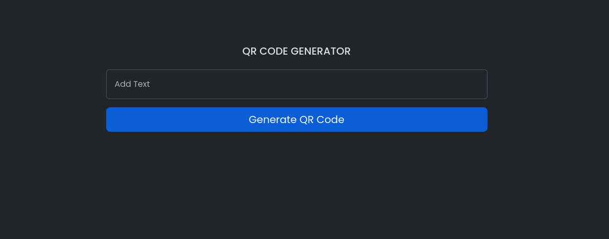

<p align="center"><a href="https://laravel.com" target="_blank"></a>


</p>

<h4 align="center">📱 Contact & 👨 Social</h4>
<p align="center">
<a href="mailto:anthonyobah37@gmail.com"></a>
<a href="https://github.com/obahchimaobi"></a>
<a href="https://linkedin.com/in/obahchimaobi"></a>
</p>

<h4 align="center">🚀 Skills</h4>
<p align="center">
<a href=""></a>
<a href=""></a>
<a href=""></a>
<a href=""></a>
<a href=""></a>
<a href=""></a>
<a href=""></a>
</p>

<h4 align="center">💻 OS</h4>
<p align="center">
<a href=""></a>
<a href=""></a>
</p>

# QR Code Generator




A simple QR Code generator built with Laravel. This application allows users to generate QR codes and download them as PNG images.

## Features

- Generate QR codes from text input
- View QR code on the web page
- Download the QR code as a PNG image

## Installation

### Prerequisites

- PHP (version 7.4 or higher)
- Composer
- Laravel (version 8.x or higher)

### Steps

1. **Clone the Repository**

   ```bash
   git clone https://github.com/obahchimaobi/qr-code-generator.git
   ```

2. **Navigate to the Project Directory**

   ```bash
   cd qr-code-generator
   ```

3. **Install Dependencies**

   ```bash
   composer install
   ```

4. **Set Up Environment**

   Copy the `.env.example` file to `.env`:

   ```bash
   cp .env.example .env
   ```

   Generate the application key:

   ```bash
   php artisan key:generate
   ```

5. **Install the QR Code Package**

   Ensure that the `gd` PHP extension is installed. Then, install the `simple-qrcode` package:

   ```bash
   composer require simplesoftwareio/simple-qrcode
   ```

6. **Set Up the Database**

   Configure your database settings in the `.env` file.

7. **Run Migrations (if applicable)**

   ```bash
   php artisan migrate
   ```

8. **Start the Laravel Development Server**

   ```bash
   php artisan serve
   ```

   Open your browser and navigate to `http://127.0.0.1:8000` to start using the QR code generator.

## Usage

### Generate a QR Code

1. Open your browser and go to `http://127.0.0.1:8000`.
2. Add the text you want to encode in the QR code.
3. You will see the generated QR code displayed on the page.

### Download the QR Code

1. On the QR code page, click the "Download QR Code" link to download the QR code as a PNG image.


## Customization

Feel free to customize the QR code size and other parameters by modifying the `QrCodeController`:

- **Size**: Change the size by modifying the `size()` method.
- **Format**: Change the format by modifying the `format()` method.

## Contributing

If you'd like to contribute to this project, please fork the repository and create a pull request with your changes. For detailed guidelines, refer to the [CONTRIBUTING.md](CONTRIBUTING.md) file.

## License

This project is licensed under the MIT License - see the [LICENSE](LICENSE) file for details.

## Contact

For any questions or support, please contact [anthonyobah37@gmail.com](mailto:anthonyobah37@gmail.com).